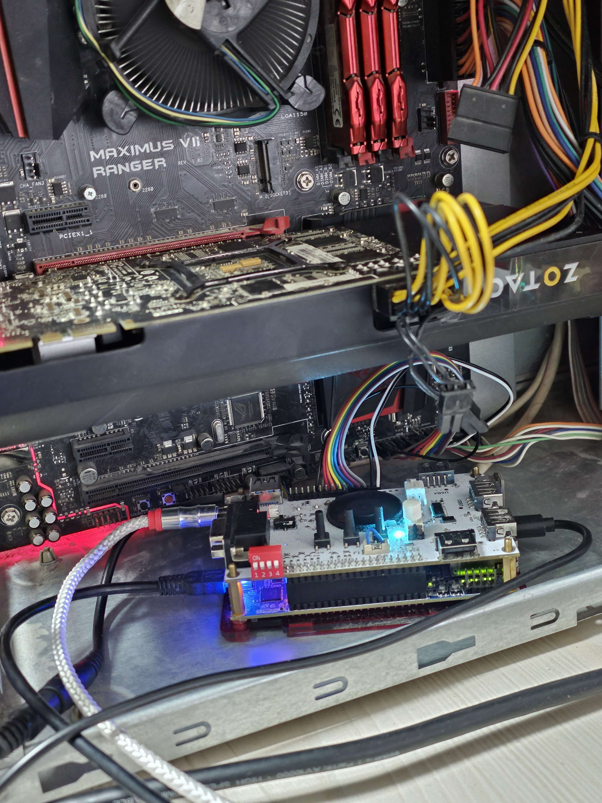

# LPC-Sound-Blaster
FPGA Sound Blaster over LPC bus experiments

## Notes
* Basic playback functions of sb pro 2 are implemented, but not mixer chip
* OPL3 is emulated using verilog port of [YMF262-LLE](https://github.com/nukeykt/YMF262-LLE)
* LPC bus is easily accessible on some boards through TPM header, but LDRQ pin usually is missing. LDRQ pin is vital for sound blaster support. Some motherboards can be modded to expose LDRQ signal.
* Also chipset is needed to be configured to allow IO ports access and enable LDRQ pin (for combined GPIO/LDRQ pin). See this for example software: https://github.com/rasteri/dISAppointment/tree/main
* Sending malformed data to LPC bus can potentially corrupt BIOS of the PC, so PLEASE do backup of BIOS image before trying to attach anything to LPC bus.

## Testbench

DE10-Nano attached to ASUS Maximus VII Ranger board (modded to expose LDRQ)

